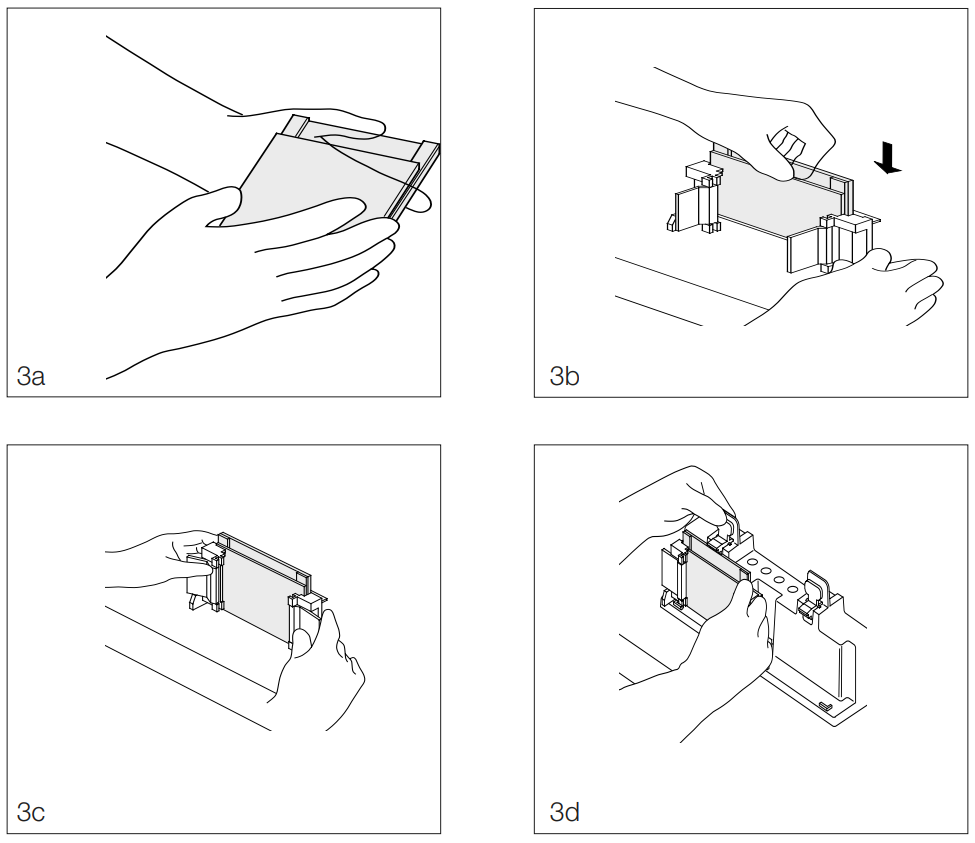

# Western blot, gel casting

## Instruments

- Glass cassette, casting frame, and casting stand
- Pipettes, etc.

## Materials

- diH~2~O
- 40% acrylamide/bis
- 1.5M Tris-HCl, pH 8.8
- 1M Tris-HCl, pH 6.8
- 10% SDS
- 10% APS
- TEMED

## Steps

1. Gently wash and dry the glass cassette with tap water, then 70% ethanol.

2. Assemble the glass cassette as in Figure \@ref(fig:biorad-10007296-rev-d-figure-3).
    1. Place the casting frame on a flat surface
    2. Insert the glass slide and spacer of the glass cassette, with spacer facing away from the locking mechanisms.
       Ensure that the bottom edges of the glass slides and spacer are in level contact with the flat surface which the casting frame is sitting upon (Figure \@ref(fig:biorad-10007296-rev-d-figure-3).3b)
    3. Lock the casting frame
    4. Place a piece of grey rectangular foam into its slot in the casting stand
    5. Secure the casting frame into the casting stand such that it rests on the grey rectangular foam (Figure \@ref(fig:biorad-10007296-rev-d-figure-3).3d)
    6. Repeat as necessary, if casting more than one gel

```{r biorad-10007296-rev-d-figure-3, echo=FALSE, out.width='100%', fig.cap='Figure 3 of Bio-Rad 10007296 Rev D.'}

```

3. Prepare the solutions for the resolving and stacking gels by adding all ingredient except APS and TEMED (Tables \@ref(tab:gel-casting-resolving-ingredients) and \@ref(tab:gel-casting-stacking-ingredients)).

```{r gel-casting-resolving-ingredients, echo=FALSE}
knitr::kable(tibble::tribble(
    ~Ingredient, ~`For 10% (mL)`, ~`8% (mL)`, ~`6% (mL)`,
    "diH~2~O", "3.8", "4.2", "4.6",
    "40% acrylamide/bis", "2.0", "1.6", "1.2",
    "1.5M Tris-HCl, pH 8.8", "2.0", "2.0", "2.0",
    "10% SDS", "0.08", "0.08", "0.08",
    "10% APS", "0.08", "0.08", "0.08",
    "TEMED", "0.008", "0.008", "0.008"),
  caption="Ingredient list for one resolving gel, for different percentages of acrylamide.")
```

```{r gel-casting-stacking-ingredients, echo=FALSE}
knitr::kable(tibble::tribble(
    ~Ingredient, ~`Volume (mL)`,
    "diH~2~O", "1.8",
    "40% acrylamide/bis", "0.37",
    "1M Tris-HCl, pH 6.8", "0.77",
    "10% SDS", "0.03",
    "10% APS", "0.03",
    "TEMED", "0.003"),
  caption="Ingredient list for one 5% stacking gel.")
```

4. To determine the amount of resolving gel solution to add: place the comb into the assembled casting frame, and mark the glass plate 1 cm below the comb teeth.
   Remove the comb once marked.

5. Complete the resolving gel solution with the appropriate amounts of APS and TEMED.
   Pipette the complete resolving gel solution into the assembled casting frame, up to the previously marked point.

6. Pipette a thin layer of isopropanol into the assembled casting frame, so that it rests just above the resolving gel solution.

7. Wait about 10 minutes for the resolving gel to set.
   The remaining resolving gel solution which was not transferred into the assembled casting frame can be used as reference.

8. Once the resolving gel is set, rinse and dab the isopropanol away with diH~2~O and paper towels.

9. Complete the stacking gel solution with the appropriate amounts of APS and TEMED.
   Pipette the complete stacking gel solution into the assembled casting frame until it almost overflows.
   
10. Place the comb into the assembled casting frame.
    The complete stacking gel solution is expected to overflow, but be careful not to let it splash.
    Wipe away any overflowing complete stacking gel solution.

11. Wait about 30 minutes for the stacking gel to set.
   The remaining stacking gel solution which was not transferred into the assembled casting frame can be used as reference.

12. The glass cassette can be removed and used immediately for electrophoresis, or kept in a 4°C fridge for about a week.
    If keeping, wrap in diH~2~O-wetted paper towels and keep in a zip lock bag. 

## Version

This is version ``r COMMON_GET_GIT_COMMIT()``, rendered on `r Sys.Date()`.
