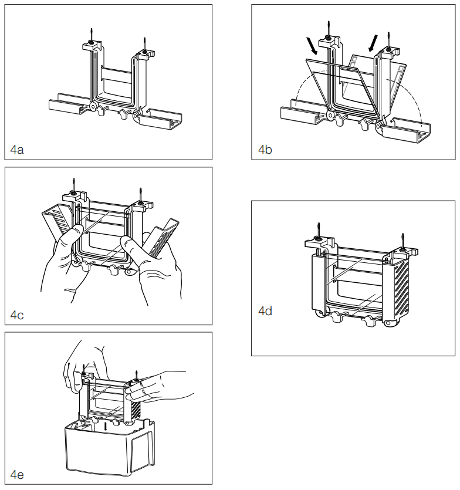

# Western blot, electrophoresis

## Instruments

- Buffer dam, clamping frame, electrophoresis tank
- Thermomixer
- Pipettes, etc.

## Materials

- Glass cassette with gel cast
- Protein samples and sample buffer
- Protein ladder

## Steps

1. Preheat the thermomixer to 100°C.

2. Prepare the protein samples such that each sample will have an equal mass of protein, sample buffer at 1X dilution, and constant volume topped up with diH~2~0.
   - For example, set the target mass of protein by considering what volume of the least concentrated protein sample can be used, while still accommodating the sample buffer at 1X dilution
   - For a 10-well 1mm thick glass cassette, try 15 μL of each protein sample

3. Denature the protein samples using the thermomixer, set to 100°C for 10 minutes.

::: {.rmdwarning}

`r COMMON_RETRIEVE_WARNING_THERMOMIXER`

:::

4. Place the glass cassette(s) into the clamping frame (Figure \@ref(fig:biorad-10007296-rev-d-figure-4).4a–4d).
   - The clamping frame requires an even number of glass cassette(s) and buffer dams if applicable, so include buffer dams as necessary.
   - Ensure that the shorter plate of the glass cassettes and buffer dams if applicable are facing inwards.
   - Ensure that the lip formed by the height difference of the tall and short plates of the glass cassette (or the analogous lip of a buffer dam if applicable) is flush against the notches of the green rubber lining of the clamping frame, for a water tight seal.
   - Use the minimum number of clamping frames.

```{r biorad-10007296-rev-d-figure-4, echo=FALSE, out.width='100%', fig.cap='Figure 4 of Bio-Rad 10007296 Rev D.'}

```

5. Place the clamping frame into the electrophoresis tank.
   Fill the inner chamber formed by the clamping frame with running buffer, allowing the running buffer to overflow into the electrophoresis tank, up to the indicated line on the electrophoresis tank.

6. Remove the comb from the glass cassette.
   Load the samples such that they settle evenly on the bottom of the wells.
   - Load the ladders such that it is easy to tell the orientation of the blot later, e.g. 5 μL of ladder on the left, and 0.5 μL on the right.

7. Place the lid on the electrophoresis tank and run at 90 V until the dye front almost reaches the bottom edge of the gel cassette, which should take one to two hours.
   - If the dye front does not exceed the bottom edge of the gel cassette, the running buffer can be reused.

## Version

This is version ``r COMMON_GET_GIT_COMMIT()``, rendered on `r Sys.Date()`.
