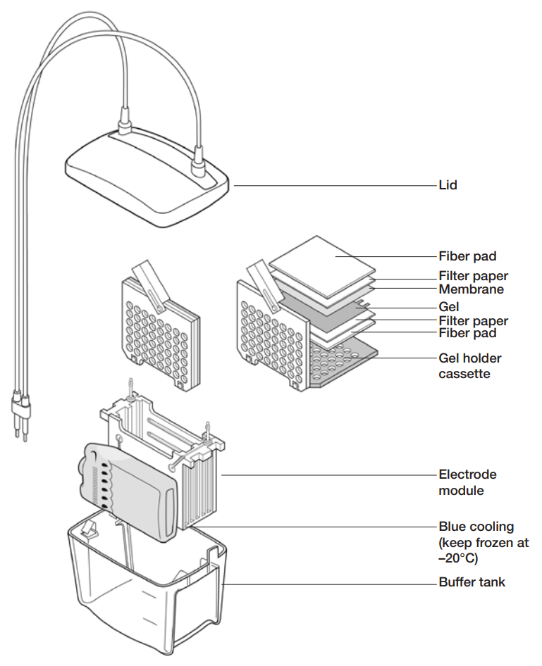

# Western blot, transfer

## Instruments

- Transfer cassette, electrode module, and buffer tank
- Forceps
- Roller
- Stir bar and stir plate
- Rocker
- Pipettes, etc.

## Materials

- Glass cassette with gel cast after electrophoresis
- PVDF membrane, sponge, and filter paper
- Pre-chilled transfer buffer
- Ice pack
- TBST
- Ponceau S
- 5% skimmed milk

## Steps

1. Incubate the PVDF membrane in methanol to activate.
   - Handle the membrane carefully, touch only the sides, preferably with forceps.

::: {.rmdwarning}

`r COMMON_RETRIEVE_WARNING_METHANOL`

:::

2. Cut two filter papers to size, using the sponge as guide.
   Soak the sponge and filter paper in cold transfer buffer.

3. Assemble the bottom half of the transfer cassette: place one piece of sponge, then one piece of filter paper (Figure \@ref(fig:biorad-M1703930-rev-k-section-2-1) with modifications).
   Press firmly with a roller to remove air bubbles.

```{r biorad-M1703930-rev-k-section-2-1, echo=FALSE, out.width='100%', fig.cap='Section 2.1 of Bio-Rad M1703930 Rev K.'}

```

4. Carefully release the gel from glass cassette.
   Scrape off the stacking gel and the dye front part of the resolving gel.
   Place the gel onto the filter paper in the transfer cassette, such that it is horizontally inverted.
   Gently roll out air bubbles with a roller.
   - The horizontally inverted gel makes it so that the blot is in the correct un-inverted orientation when transferred to the PVDF membrane, which is the next layer of the transfer cassette.
   - Use the roller gently, or the blots of the gel later may smudge.

5. Place the activated PVDF membrane onto the gel in the transfer cassette.
   Gently roll out air bubbles with a roller.

6. Place a piece of filter paper onto the activated PVDF membrane in the transfer cassette.
   Gently roll out air bubbles with a roller.
   
7. Place a piece of sponge onto the activated PVDF membrane in the transfer cassette.
   Close the transfer cassette.

8. Place the transfer cassette into the electrode module, and then electrode module into the buffer tank.
   Add an ice pack and stirrer also (Figure \@ref(fig:biorad-M1703930-rev-k-section-2-1) with modifications).
   Top up with transfer buffer until the top ridge (not the top edge) of the buffer tank.

9. Move the buffer tank into the 4°C cold room.
   Set the stir plate on high, and run at 100 V and 350 mA for 1 hour.

10. Remove the PVDF membrane and wash thrice with TBST.

::: {.rmdnote}

`r COMMON_RETRIEVE_NOTE_WESTERN_BLOT_WASH`

:::

11. Stain with Ponceau S to confirm the transfer, then wash thrice with TBST.

12. Incubate the PVDF membrane with 5% skimmed milk for 1 hour at room temperature, at 1 rpm on the rocker.

## Version

This is version ``r COMMON_GET_GIT_COMMIT()``, rendered on `r Sys.Date()`.
